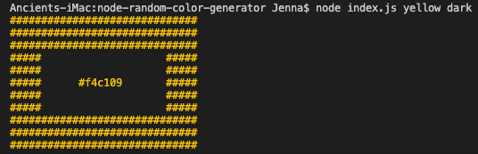

# Node random color generator

_**Generates random hex color and displays in that color**_

This was created by Jenna Koelbl in Sept 2020
It is node module based and runs in the command line

There is an extra option, but still finalizing the code on it.
It is commented out, as well as the packages it needs.

# Repl.it Preview

https://repl.it/@jaylenej27/node-random-color-generator

# Example

